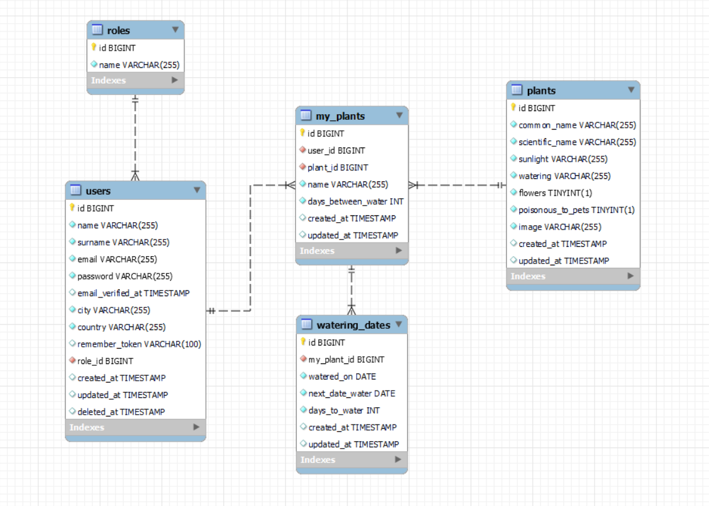

*First in Spanish then in* [*English*](https://github.com/ansualo/backend-proyectofinal#final-project---verda---backend)


# PROYECTO FINAL - VERDA - BACKEND

<details>
  <summary>Contenido 📝</summary>
  <ol>
    <li><a href="#objetivo">Objetivo</a></li>
    <li><a href="#sobre-el-proyecto">Sobre el proyecto</a></li>
    <li><a href="#stack">Stack</a></li>
    <li><a href="#diagrama-bd">Diagrama</a></li>
    <li><a href="#instalación-en-local">Instalación</a></li>
    <li><a href="#endpoints">Endpoints</a></li>
    <li><a href="#licencia">Licencia</a></li>
    <li><a href="#contacto">Contacto</a></li>
  </ol>
</details>

## Objetivo

En el siguiente proyecto se ha llevado a cabo la creación del backend para el proyecto final del bootcamp Full Stack Developer en GeeksHubs Academy. El proyecto completo debía realizarse en una duración de dos semanas y, en esta parte, se desarrolló una API REST utilizando Laravel, la cual fue utilizada para alimentar las vistas del frontend.


## Sobre el proyecto

El proyecto consiste en una página web diseñada para los amantes de las plantas de interior. Los usuarios podrán buscar información detallada sobre diversas especies y, además, tendrán la opción de añadir las plantas que poseen a su perfil, lo que les permitirá llevar un control preciso de su riego y cuidado.


## Stack
Tecnologías utilizadas:
<div align="center">

    

</div>


## Diagrama BD


## Instalación en local
1. Clona el repositorio `$git clone 'url-repository'`
2. Instala las dependencias `composer install`
3. Crea el archivo `.env` y configura la base de datos
4. Ejecuta las migraciones y seeders `php artisan migrate` `php artisan db:seed`
5. Conectamos el servidor`php artisan serve`
6. Ejecuta este archivo en Postman para habilitar el acceso a los endpoints del proyecto: [](https://app.getpostman.com/run-collection/27848134-1e6f6087-17ed-4923-9226-eb53766accb7?action=collection%2Ffork&source=rip_markdown&collection-url=entityId%3D27848134-1e6f6087-17ed-4923-9226-eb53766accb7%26entityType%3Dcollection%26workspaceId%3Dd21a4afd-fecf-498d-817a-74ca421ad0c8)

## Endpoints
<details>
<summary>Endpoints</summary>

-   AUTH

    -   REGISTER

              POST http://localhost:8000/api/register

        body:

        ```js
            {
                "name": "Andrea",
                "surname": "Suarez",
                "email": "andrea@andrea.com",
                "password": "Andrea1234",
                "city": "Valencia",
                "country": "Spain"
            }
        ```

    -   LOGIN

              POST http://localhost:8000/api/login

        body:

        ```js
            {
                "email": "andrea@andrea.com",
                "password": "Andrea1234"
            }
        ```

    -   LOGOUT

            POST http://localhost:8000/api/logout

-   USERS

    -   GET PROFILE

              GET localhost:8000/api/profile

    -   UPDATE PROFILE

              PUT localhost:8000/api/profile

        body:

        ```js
            {
                "name": "Andrea",
                "surname": "Suarez",
                "city": "Valencia",
                "country": "Spain"
            }
        ```

    -   DELETE PROFILE (as user)

              DELETE localhost:8000/api/profile

     -   DELETE PROFILE AS ADMIN (admin)

              DELETE localhost:8000/api/profile/:id

    -   RESTORE PROFILE (admin)

              POST localhost:8000/api/profile/:id

    -   GET All USERS (admin)

              GET localhost:8000/api/allusers

    -   GET DELETED USERS (admin)

              GET localhost:8000/api/allusers/deleted

-   PLANTS

    -   GET ALL PLANTS 

              GET localhost:8000/api/plants

    -   GET PLANTS BY ID

              GET localhost:8000/api/plants/:id

    -   GET PLANTS BY NAME

              POST localhost:8000/api/plants/name

        body:

        ```js
            {
                "name": "aloe"
            }
        ```
    -   GET PLANTS BY SUNLIGHT

              POST localhost:8000/api/plants/sunlight

        body:

        ```js
            {
                "sunlight": "Full sun"
            }
        ```
    -   GET PLANTS BY WATERING

              POST localhost:8000/api/plants/watering

        body:

        ```js
            {
                "watering": "Part sun/Part shade"
            }
        ```
    -   GET PLANTS BY FLOWERS

              POST localhost:8000/api/plants/flowers

        body:

        ```js
            {
                "flowers": true
            }
        ```

    -   GET PLANTS BY POISONOUS

              POST localhost:8000/api/plants/poisonous

        body:

        ```js
            {
                 "poisonous": false
            }
        ```
    -   CREATE PLANT

              POST localhost:8000/api/plants

        body:

        ```js
            {
                "common_name": "Example",
                "scientific_name": "Example",
                "sunlight": "Full Sun",
                "watering": "Average",
                "flowers": true,
                "poisonous_to_pets": false
            }
        ```


-   MY PLANTS

    -   GET MY PLANTS BY USER

              GET localhost:8000/api/myplants

    -   GET MY PLANTS BY ID

              GET localhost:8000/api/myplants/:id

    -   GET MY PLANTS BY PLANT ID

              GET localhost:8000/api/myplants/plant/:id

    -   GET MY PLANTS WATER TODAY

              GET localhost:8000/api/myplants/watertoday

    -   GET MY PLANTS NOT WATER TODAY

              GET localhost:8000/api/myplants/notwatertoday

    -   CREATE MY PLANT

              POST localhost:8000/api/myplants/:id

        body:

        ```js
            {
                "name": "Kitchen little plant",
                "days_between_water" : 10
            }
        ```

    -   UPDATE MY PLANT

              POST localhost:8000/api/myplants/:id

        body:

        ```js
            {
                "name": "Kitchen big plant",
                "days_between_water" : 7
            }
        ```

    -   DELETE MY PLANT

              DELETE localhost:8000/api/myplants/:id

- WATERING DATES

    -   GET WATERING DATE

              GET localhost:8000/api/water/:id

    -   CREATE WATERING DATE

              POST localhost:8000/api/water

        body:

        ```js
            {
                "my_plant_id": 20,
                "watered_on": "2023-07-22"
            }
        ```

    -   UPDATE WATERING DATE

              POST localhost:8000/api/water

        body:

        ```js
            {
                "id": 1,
                "watered_on": "2023-08-10"
            }
        ```

    -   DELETE WATERING DATE

              DELETE localhost:8000/api/water/:id


</details>


## Licencia
Este proyecto se encuentra bajo licencia MIT.


## Contacto
<a href = "mailto:andrea.sualo@gmail.com"></a>
<a href="https://www.linkedin.com/in/andrea-suarez-lopez90569a5/" target="_blank"></a> 
</p>

---
---
---

# FINAL PROJECT - VERDA - BACKEND

<details>
  <summary>Contenido 📝</summary>
  <ol>
    <li><a href="#objective">Objective</a></li>
    <li><a href="#about-the-project">About the project</a></li>
    <li><a href="#stack">Stack</a></li>
    <li><a href="#db-diagram">Diagram</a></li>
    <li><a href="#local-installation">Local installation</a></li>
    <li><a href="#endpoints">Endpoints</a></li>
    <li><a href="#license">License</a></li>
    <li><a href="#contact">Contact</a></li>
  </ol>
</details>

## Objective

The following project involved the creation of the backend for the final project of the Full Stack Developer bootcamp at GeeksHubs Academy. The whole project needed to be completed in a duration of two weeks and, in this part, a REST API was developed using Laravel, which was used to feed the frontend views.

## About the project

The project consists of a website designed for indoor plant lovers. Users will be able to search for detailed information on various species and will also have the option to add the plants they own to their profile, allowing them to keep precise control of their watering and care.


## Stack
Technologies used:
<div align="center">

    

</div>


## DB Diagram


## Local installation
1. Clone the repository `$git clone 'url-repository'`.
2. Install dependencies `$composer install`.
3. Create the `.env` file and set up the database.
4. Run the `php artisan migrate` `php artisan db:seed` migrations and seeders.
5. Connect the `php artisan serve` server.
6. Run this file in Postman to enable access to the project endpoints:[](https://app.getpostman.com/run-collection/27848134-1e6f6087-17ed-4923-9226-eb53766accb7?action=collection%2Ffork&source=rip_markdown&collection-url=entityId%3D27848134-1e6f6087-17ed-4923-9226-eb53766accb7%26entityType%3Dcollection%26workspaceId%3Dd21a4afd-fecf-498d-817a-74ca421ad0c8)

## Endpoints
<details>
<summary>Endpoints</summary>

-   AUTH

    -   REGISTER

              POST http://localhost:8000/api/register

        body:

        ```js
            {
                "name": "Andrea",
                "surname": "Suarez",
                "email": "andrea@andrea.com",
                "password": "Andrea1234",
                "city": "Valencia",
                "country": "Spain"
            }
        ```

    -   LOGIN

              POST http://localhost:8000/api/login

        body:

        ```js
            {
                "email": "andrea@andrea.com",
                "password": "Andrea1234"
            }
        ```

    -   LOGOUT

            POST http://localhost:8000/api/logout

-   USERS

    -   GET PROFILE

              GET localhost:8000/api/profile

    -   UPDATE PROFILE

              PUT localhost:8000/api/profile

        body:

        ```js
            {
                "name": "Andrea",
                "surname": "Suarez",
                "city": "Valencia",
                "country": "Spain"
            }
        ```

    -   DELETE PROFILE (as user)

              DELETE localhost:8000/api/profile

     -   DELETE PROFILE AS ADMIN (admin)

              DELETE localhost:8000/api/profile/:id

    -   RESTORE PROFILE (admin)

              POST localhost:8000/api/profile/:id

    -   GET All USERS (admin)

              GET localhost:8000/api/allusers

    -   GET DELETED USERS (admin)

              GET localhost:8000/api/allusers/deleted

-   PLANTS

    -   GET ALL PLANTS 

              GET localhost:8000/api/plants

    -   GET PLANTS BY ID

              GET localhost:8000/api/plants/:id

    -   GET PLANTS BY NAME

              POST localhost:8000/api/plants/name

        body:

        ```js
            {
                "name": "aloe"
            }
        ```
    -   GET PLANTS BY SUNLIGHT

              POST localhost:8000/api/plants/sunlight

        body:

        ```js
            {
                "sunlight": "Full sun"
            }
        ```
    -   GET PLANTS BY WATERING

              POST localhost:8000/api/plants/watering

        body:

        ```js
            {
                "watering": "Part sun/Part shade"
            }
        ```
    -   GET PLANTS BY FLOWERS

              POST localhost:8000/api/plants/flowers

        body:

        ```js
            {
                "flowers": true
            }
        ```

    -   GET PLANTS BY POISONOUS

              POST localhost:8000/api/plants/poisonous

        body:

        ```js
            {
                 "poisonous": false
            }
        ```
    -   CREATE PLANT

              POST localhost:8000/api/plants

        body:

        ```js
            {
                "common_name": "Example",
                "scientific_name": "Example",
                "sunlight": "Full Sun",
                "watering": "Average",
                "flowers": true,
                "poisonous_to_pets": false
            }
        ```


-   MY PLANTS

    -   GET MY PLANTS BY USER

              GET localhost:8000/api/myplants

    -   GET MY PLANTS BY ID

              GET localhost:8000/api/myplants/:id

    -   GET MY PLANTS BY PLANT ID

              GET localhost:8000/api/myplants/plant/:id

    -   GET MY PLANTS WATER TODAY

              GET localhost:8000/api/myplants/watertoday

    -   GET MY PLANTS NOT WATER TODAY

              GET localhost:8000/api/myplants/notwatertoday

    -   CREATE MY PLANT

              POST localhost:8000/api/myplants/:id

        body:

        ```js
            {
                "name": "Kitchen little plant",
                "days_between_water" : 10
            }
        ```

    -   UPDATE MY PLANT

              POST localhost:8000/api/myplants/:id

        body:

        ```js
            {
                "name": "Kitchen big plant",
                "days_between_water" : 7
            }
        ```

    -   DELETE MY PLANT

              DELETE localhost:8000/api/myplants/:id

- WATERING DATES

    -   GET WATERING DATE

              GET localhost:8000/api/water/:id

    -   CREATE WATERING DATE

              POST localhost:8000/api/water

        body:

        ```js
            {
                "my_plant_id": 20,
                "watered_on": "2023-07-22"
            }
        ```

    -   UPDATE WATERING DATE

              POST localhost:8000/api/water

        body:

        ```js
            {
                "id": 1,
                "watered_on": "2023-08-10"
            }
        ```

    -   DELETE WATERING DATE

              DELETE localhost:8000/api/water/:id


</details>


## License
This project is under MIT licence.


## Contact
<a href = "mailto:andrea.sualo@gmail.com"></a>
<a href="https://www.linkedin.com/in/andrea-suarez-lopez90569a5/" target="_blank"></a> 
</p>

